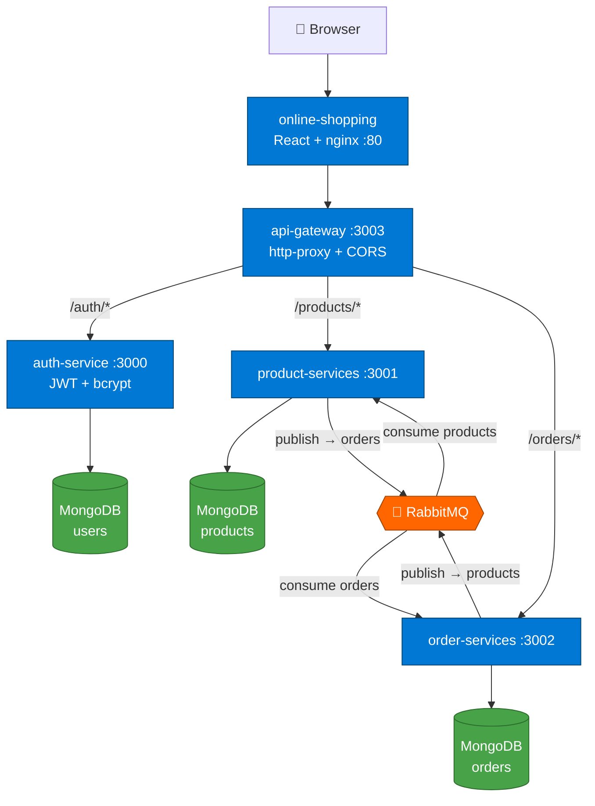
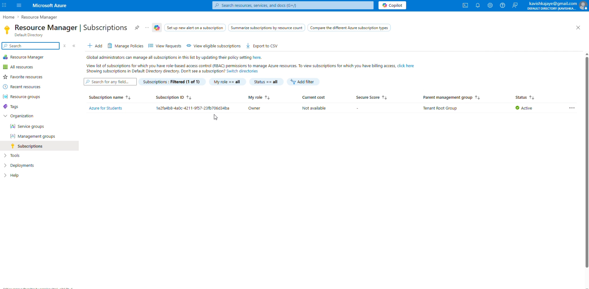
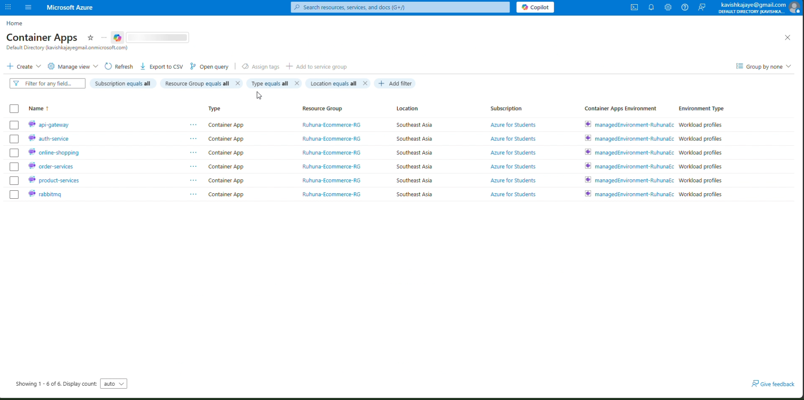
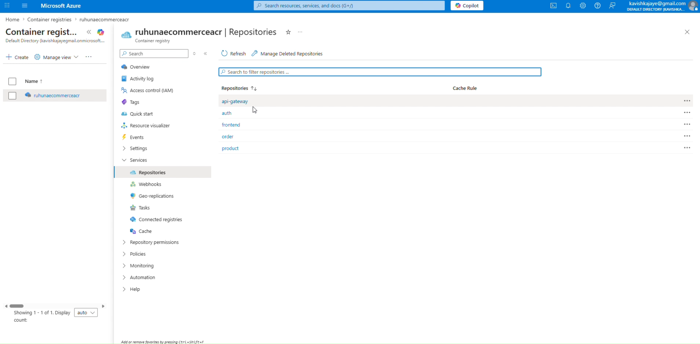
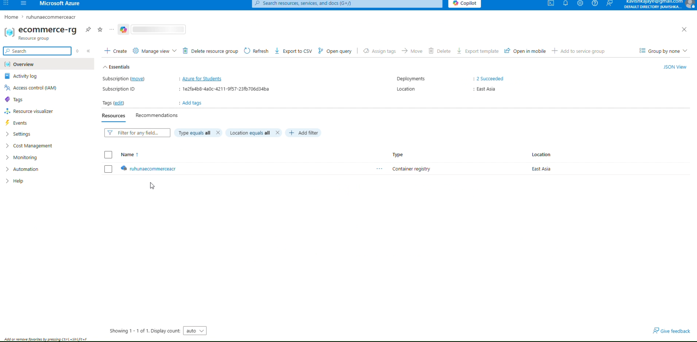
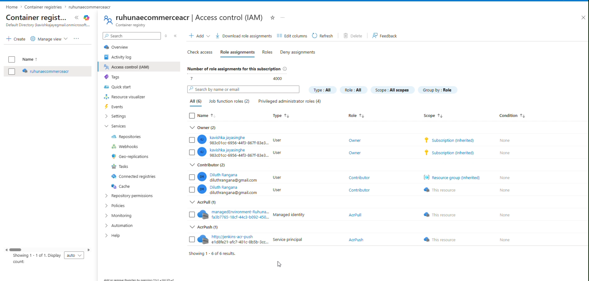
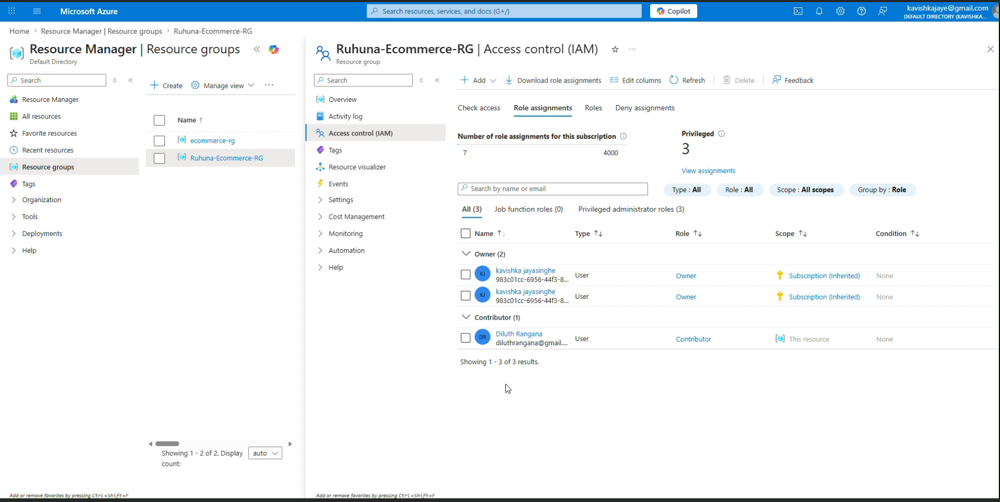
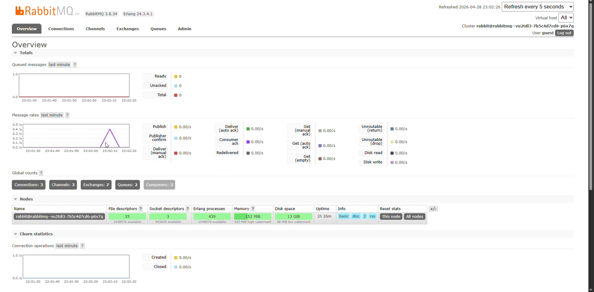
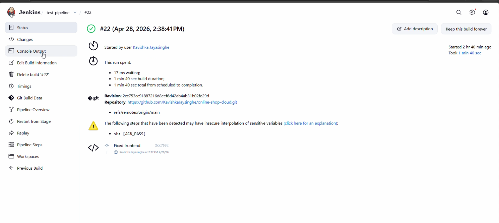
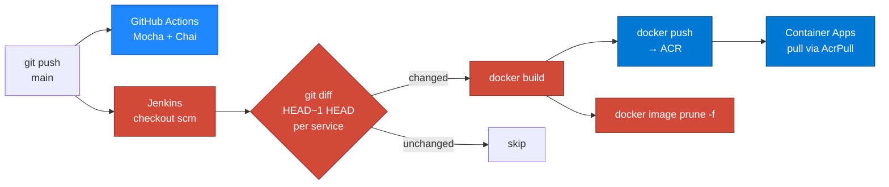

<div align="center">

# 🛒 NimbusCart

### A cloud-native e-commerce platform built on event-driven microservices, shipped to Azure through a Jenkins CI/CD pipeline.

[](https://nodejs.org)
[](https://react.dev)
[](https://typescriptlang.org)
[](https://docker.com)
[](https://rabbitmq.com)
[](https://mongodb.com)
[](https://azure.microsoft.com)
[](https://jenkins.io)

</div>

---

## Overview

**NimbusCart** is a shop-front and back office split into five independently deployable services. Browsing and authentication run over HTTP through a single API gateway; checkout runs over **AMQP** so the product and order services never block on each other or on a synchronous database round-trip.

Everything is containerised. A **Jenkins** pipeline detects which service folders actually changed in a commit, builds only those images, pushes them to **Azure Container Registry**, and the **Azure Container Apps** environment pulls the new revision using a managed identity — no registry passwords stored in the runtime.

| | |
|---|---|
| **Frontend** | React 18 + TypeScript + Vite + Tailwind, served by nginx |
| **Backend** | 4 × Node.js/Express services (auth, product, order, gateway) |
| **Messaging** | RabbitMQ — `orders` and `products` queues |
| **Data** | MongoDB (one database per service) |
| **CI** | GitHub Actions — Mocha + Chai integration tests |
| **CD** | Jenkins → Azure Container Registry → Azure Container Apps |
| **Cloud** | Azure for Students · Southeast Asia / East Asia |

---

## Architecture



### Why a message broker for checkout

The gateway is a thin proxy — it binds every service behind one origin so the browser only ever talks to one hostname. Read traffic (login, product listing) stays synchronous REST. Checkout does not:

1. `POST /products/api/products/buy` — the **product** service resolves the cart items, mints an `orderId`, and publishes `{ products, username, orderId }` to the `orders` queue.
2. The **order** service consumes that message, computes the total, persists the order, ACKs, and publishes the fulfilled order back to the `products` queue.
3. The **product** service consumes the confirmation, matches it by `orderId`, and returns the completed order to the caller.

Neither service holds a REST connection open to the other, and neither needs credentials to the other's database.

### Service internals

Each backend service follows a **Clean Architecture**-inspired layout — `routes → controllers → services → repositories → models` — so the transport layer stays swappable and business logic stays testable in isolation.

---

## Cloud Infrastructure

The whole platform runs on a single **Azure for Students** subscription, split across two resource groups: `Ruhuna-Ecommerce-RG` (Southeast Asia) for the runtime, and `ecommerce-rg` (East Asia) for the container registry.

<div align="center">

<p><em>Subscription scope — <code>Azure for Students</code>, Owner role, Tenant Root Group</em></p>
</div>

### Azure Container Apps

All six workloads run as serverless container apps in one managed environment (`managedEnvironment-RuhunaEc…`) using **workload profiles**, which gives them a shared internal DNS namespace — that is why the gateway can target `http://auth-service` rather than a public URL.

<div align="center">

<p><em><code>api-gateway</code> · <code>auth-service</code> · <code>online-shopping</code> · <code>order-services</code> · <code>product-services</code> · <code>rabbitmq</code></em></p>
</div>

| Container App | Role | Ingress |
|---|---|---|
| `online-shopping` | React SPA on nginx | External |
| `api-gateway` | Single public entry point | External |
| `auth-service` | Registration, login, JWT issuance | Internal |
| `product-services` | Catalogue + checkout publisher | Internal |
| `order-services` | Order consumer + persistence | Internal |
| `rabbitmq` | Message broker + management UI | Internal |

### Azure Container Registry

`ruhunaecommerceacr.azurecr.io` holds one repository per service. Jenkins pushes `:latest` on every successful build.

<div align="center">

<p><em>Five image repositories — <code>api-gateway</code>, <code>auth</code>, <code>frontend</code>, <code>order</code>, <code>product</code></em></p>
</div>

<div align="center">

<p><em>Registry resource group, East Asia</em></p>
</div>

### Identity & Access Management (RBAC)

Access is granted per-scope with least privilege, using two different identity types instead of shared admin credentials:

<div align="center">

<p><em>Registry role assignments — note <code>AcrPull</code> on a managed identity and <code>AcrPush</code> on a service principal</em></p>
</div>

| Principal | Type | Role | Scope | Purpose |
|---|---|---|---|---|
| `managedEnvironment-Ruhuna…` | Managed identity | **AcrPull** | Registry | Container Apps pull images with no stored secret |
| `jenkins-acr-push` | Service principal | **AcrPush** | Registry | Build agent pushes images; cannot deploy or delete |
| Project owner | User | Owner | Subscription (inherited) | Administration |
| Collaborator | User | Contributor | Resource group / registry | Team access without role-assignment rights |

<div align="center">

<p><em>Runtime resource group — Owner (inherited from subscription) and a scoped Contributor</em></p>
</div>

**The separation that matters:** the Jenkins service principal can *push* but never *pull into production*, and the Container Apps managed identity can *pull* but never *push*. A compromised build agent cannot alter what is already running, and the runtime holds no registry password at all.

### RabbitMQ

The broker runs as a container app with its management UI exposed for observability — queue depth, consumer count and message rates during checkout.

<div align="center">

<p><em>Live broker — 2 queues (<code>orders</code>, <code>products</code>), 3 consumers, 3 open channels</em></p>
</div>

---

## CI/CD Pipeline

<div align="center">

<p><em>Build #22 — full multi-service build and push in <strong>1 min 40 sec</strong></em></p>
</div>



### Selective builds

The interesting part of [`Jenkinsfile`](Jenkinsfile) is that it does not rebuild the monolith on every commit. For each of the five services it runs `git diff --quiet HEAD~1 HEAD -- <service>` and only builds when the exit code is non-zero:

```groovy
def statusCode = sh(script: "git diff --quiet HEAD~1 HEAD -- ${s}", returnStatus: true)
if (statusCode != 0) {
    sh "docker build -t ${ACR_URL}/${s}:latest ./${s}"
    sh "docker push  ${ACR_URL}/${s}:latest"
}
```

A one-line frontend fix rebuilds one image instead of five. The `always` block runs `docker image prune -f` so the agent's disk does not fill up over long-running builds.

> **First run caveat:** `HEAD~1` does not exist on the very first commit of a fresh checkout — build all services once manually before relying on the diff.

### Jenkins setup

| Setting | Value |
|---|---|
| Job type | Pipeline (`Pipeline script from SCM`) |
| Repository | `https://github.com/KavishkaJaysinghe/online-shop-cloud.git` |
| Branch | `main` |
| Credential ID | `azure-registry-credentials` (username/password of the `AcrPush` service principal) |
| Registry | `ruhunaecommerceacr.azurecr.io` |

### Test pipeline (GitHub Actions)

[`.github/workflows`](.github/workflows) runs on every push and pull request: it materialises `.env` files from repository secrets, installs with `npm ci`, then runs the Mocha suites for `auth` and `product` (the product suite boots the auth service first so it can obtain a real JWT).

---

## Running Locally

### Prerequisites

- [Node.js](https://nodejs.org) 18+ and npm
- [Docker](https://docker.com) + Docker Compose
- A MongoDB instance (Atlas or local)

### 1. Environment variables

Create a `.env` in each service directory:

<details>
<summary><code>auth/.env</code></summary>

```env
MONGODB_AUTH_URI=mongodb://localhost:27017/auth
JWT_SECRET=your_shared_secret
```
</details>

<details>
<summary><code>product/.env</code></summary>

```env
PORT=3001
MONGODB_PRODUCT_URI=mongodb://localhost:27017/products
RABBITMQ_URI=amqp://localhost
JWT_SECRET=your_shared_secret
```
</details>

<details>
<summary><code>order/.env</code></summary>

```env
MONGODB_ORDER_URI=mongodb://localhost:27017/orders
JWT_SECRET=your_shared_secret
```
</details>

> `JWT_SECRET` **must be identical across all three services** — the gateway forwards the token issued by `auth` and both other services verify it independently.

### 2. Start with Docker Compose

```bash
docker-compose build && docker-compose up
```

| Surface | URL |
|---|---|
| Frontend | http://localhost:3004 |
| API Gateway | http://localhost:3003 |
| RabbitMQ management | http://localhost:15672 (`guest` / `guest`) |

### 3. Or run on the host

```bash
npm install --prefix auth && npm install --prefix product && npm install --prefix order && npm install --prefix api-gateway
```

Then `npm start` in each of the four directories, plus `npm run dev` in `frontend`.

To point the frontend at a different backend, set `VITE_API_GATEWAY_URL` — it defaults to the deployed Azure gateway.

### 4. Tests

```bash
npm test
```

---

## API Reference

All routes are reached through the gateway on port `3003`.

### Auth — `/auth`

| Method | Endpoint | Auth | Description |
|---|---|---|---|
| `POST` | `/auth/register` | — | Create an account (bcrypt-hashed password) |
| `POST` | `/auth/login` | — | Exchange credentials for a JWT |
| `GET` | `/auth/dashboard` | Bearer | Protected probe route |

### Products — `/products/api/products`

| Method | Endpoint | Auth | Description |
|---|---|---|---|
| `GET` | `/products/api/products` | Bearer | List the catalogue |
| `POST` | `/products/api/products` | Bearer | Create a product |
| `POST` | `/products/api/products/buy` | Bearer | Place an order — publishes to `orders`, returns once fulfilled |

Unreachable services return `502` with a structured body rather than crashing the gateway:

```json
{ "error": "Bad Gateway", "message": "The requested service is currently unreachable." }
```

---

## Project Structure

```
.
├── api-gateway/        # http-proxy entry point, CORS, 502 handling
├── auth/               # JWT auth — controllers, services, repositories, models
├── product/            # Catalogue + checkout publisher + message broker
├── order/              # Order consumer, persistence, fulfilment publisher
├── frontend/           # React 18 + TS + Vite + Tailwind → nginx image
├── utils/              # Shared JWT verification middleware
├── docs/assets/        # Infrastructure and pipeline screenshots
├── .github/workflows/  # CI — Mocha test run
├── Jenkinsfile         # CD — selective build → ACR push
└── docker-compose.yml  # Full local stack incl. RabbitMQ
```

---

## Known Limitations & Roadmap

- **Image tagging** — the pipeline pushes `:latest` only. Tagging with `${BUILD_NUMBER}` or the commit SHA would make rollbacks possible and give Container Apps a real revision history.
- **Secret interpolation in Jenkins** — Jenkins flags `sh "echo ${ACR_PASS} | docker login …"` as insecure interpolation (visible in build #22). Switching to a single-quoted `sh '…'` block keeps the secret in the shell environment instead of the generated script.
- **Long-polling checkout** — `createOrder` blocks in a `while` loop until the confirmation arrives. A callback URL, SSE, or a status endpoint the client polls would free the request thread.
- **In-memory order map** — `ordersMap` lives in a single process, so the product service cannot scale beyond one replica without losing in-flight orders. Redis would fix this.
- **Fixed broker startup delays** — services wait 10–20 s for RabbitMQ instead of retrying with backoff.
- **Deployment step** — Jenkins stops at the registry push; adding an `az containerapp update` stage would close the loop to a true continuous deployment.
- **Kubernetes (AKS)** — Container Apps covers current needs, but AKS would allow finer-grained scaling and service-mesh policies.

---

## Credits

Microservice foundation adapted from [nicholas-gcc/nodejs-ecommerce-microservice](https://github.com/nicholas-gcc/nodejs-ecommerce-microservice). The React frontend, API gateway rewrite, containerisation, Jenkins pipeline, and the entire Azure deployment (Container Apps, ACR, RBAC) are original work for this project.

<div align="center">

**Built by [Kavishka Jayasinghe](https://github.com/KavishkaJaysinghe)**

</div>
